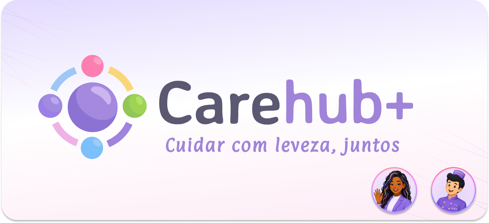

# CareHub Plus

<div align="center">
  
</div>

## Sobre o projeto

O **CareHub Plus** é um aplicativo mobile de cuidado e acompanhamento desenvolvido com Flutter e Firebase. Ele foi pensado para ajudar o cuidador a organizar a rotina de uma ou mais pessoas ou pets assistidos, reunindo tarefas, perfis, rede de apoio, conversas, indicadores e um fluxo de pedido de ajuda em um só lugar.

No domínio do aplicativo, o **cuidador** é a pessoa autenticada responsável pela conta. O **assistido** é a pessoa ou o pet acompanhado. Essa separação é importante: as informações de tarefas, dashboard, rede de apoio, conversas e SOS são vinculadas ao assistido selecionado por meio do `careRecipientId`, e não diretamente ao cuidador.

> **Propósito:** transformar o cuidado diário em uma jornada mais organizada, humana e compartilhada.

## Funcionalidades

### Conta e autenticação

- Cadastro e login com e-mail e senha.
- Login social com Google e Facebook, mediante habilitação dos provedores no Firebase e configuração nativa correspondente.
- Recuperação de senha por e-mail.
- Observação global da sessão autenticada.
- Logout.
- Edição do perfil do cuidador.

### Perfis de assistidos

- Cadastro de pessoas ou pets.
- Registro de nome, tipo, data de nascimento e imagem.
- Seleção do assistido ativo na área inicial.
- Exclusão de perfis cadastrados.
- Separação dos dados por `careRecipientId`.

### Rotina e acompanhamento

- Dashboard individual para cada assistido.
- Progresso diário e quantidade de tarefas concluídas.
- Visualização da próxima tarefa e de tarefas em atraso.
- Criação, conclusão, reabertura e exclusão de tarefas.
- Registro de observação ao reabrir uma tarefa.
- Categorias de cuidado reutilizáveis em tarefas e conversas.

### Rede de apoio e comunicação

- Cadastro, edição e remoção de membros da rede de apoio.
- Salas de conversa vinculadas ao assistido.
- Envio e consulta de mensagens.
- Organização das salas por categoria e membro responsável.
- Indicadores de mensagens não lidas no dashboard.

### Apoio e segurança

- Fluxo de SOS com seleção do assistido, tarefa aberta e contatos da rede de apoio.
- Contagem regressiva e possibilidade de cancelamento do alerta.
- Etapa de atendimento aceito por alguém da rede.
- Assistente **Cora**, voltada a orientações relacionadas ao cuidado.
- Assistente **Toke**, voltado ao suporte e à orientação sobre o uso do aplicativo.
- Preferências de notificação da conta.

### Outras áreas

- Configurações da conta.
- Conteúdo institucional da área Sobre.
- Visualização do catálogo de planos e assinaturas.

## Tecnologias utilizadas

### Aplicação

- **Flutter** — desenvolvimento multiplataforma para Android e iOS.
- **Dart SDK `^3.8.1`** — linguagem da aplicação.
- **flutter_bloc `^8.1.6`** — gerenciamento de estado com BLoC.
- **equatable `^2.0.7`** — comparação de estados e entidades.
- **go_router `^14.8.1`** — navegação por rotas nomeadas.

### Firebase e autenticação

- **firebase_core `^2.32.0`** — inicialização do Firebase.
- **firebase_auth `^4.19.0`** — autenticação de usuários.
- **cloud_firestore `^4.17.0`** — persistência e consulta de dados.
- **google_sign_in `^6.2.1`** — login com Google.
- **flutter_facebook_auth `^6.0.4`** — login com Facebook.

### Interface e recursos do dispositivo

- **google_fonts `^6.2.1`** — tipografia da interface.
- **flutter_svg `^2.2.3`** — utilização de recursos SVG.
- **material_symbols_icons `^4.2960.0`** — ícones da aplicação.
- **shared_preferences `^2.5.5`** — armazenamento local de preferências e categorias.
- **image_picker `^1.1.2`** — seleção de imagens do dispositivo.
- **url_launcher `^6.3.0`** — abertura de links externos.

### Desenvolvimento e testes

- **flutter_lints `^5.0.0`** — regras de análise estática.
- **flutter_launcher_icons `^0.14.4`** — geração dos ícones nativos.
- **flutter_native_splash `^2.4.7`** — configuração da tela inicial.
- **bloc_test `^9.1.7`** — testes de BLoCs.
- **mocktail `^1.0.4`** — criação de mocks nos testes.

> As versões acima são as restrições declaradas em `pubspec.yaml`. O `pubspec.lock` pode resolver versões de patch mais recentes dentro dessas restrições. Não é necessário atualizar dependências para executar o projeto.

## Pré-requisitos

### Requisitos gerais

- [Flutter](https://docs.flutter.dev/get-started/install) instalado no canal **stable**.
- Dart compatível com a restrição `^3.8.1` do projeto. O Dart já acompanha o Flutter; não é necessário instalá-lo separadamente.
- Git para obter o código-fonte.

### Android

- [Android Studio](https://developer.android.com/studio).
- Android SDK, ferramentas de SDK e um dispositivo físico ou emulador.
- Java/JDK 17 para executar o Android Gradle Plugin utilizado pelo projeto.
- Licenças do Android SDK aceitas.

A configuração Android atual usa:

- **Application ID:** `com.carehubplus.carehub_plus`.
- **Android Gradle Plugin:** `8.11.1`.
- **Gradle:** `8.14`.
- **Google Services Gradle Plugin:** `4.3.15`.
- **Java source/target:** 11 no código Android, com JDK 17 para executar o processo de build.

### iOS

- Um computador com macOS.
- [Xcode](https://developer.apple.com/xcode/) instalado.
- Um simulador ou dispositivo iOS.
- CocoaPods configurado no ambiente, quando solicitado pelo Xcode ou pelo Flutter.

Não é possível compilar ou executar o aplicativo iOS no Windows. O projeto contém a pasta `ios/` e opções Firebase para iOS, mas o uso de login social nessa plataforma ainda exige completar as configurações nativas dos provedores.

## Como executar

Execute todos os comandos a partir da raiz do projeto.

### 1. Obter o projeto

```bash
git clone https://github.com/gabriel-steixeira/carehub-plus.git
cd carehub-plus
```

Se o repositório já estiver no computador, apenas abra a pasta `carehub-plus` no terminal.

### 2. Conferir o ambiente

```bash
flutter doctor -v
```

No Android, aceite as licenças caso existam pendências:

```bash
flutter doctor --android-licenses
```

Resolva os problemas relacionados à plataforma que será utilizada antes de continuar. Avisos referentes a plataformas que não são alvo deste projeto não impedem a execução Android/iOS, desde que a plataforma desejada esteja pronta.

### 3. Instalar as dependências

```bash
flutter pub get
```

O projeto não utiliza geração de código com `freezed` ou `json_serializable`, nem depende de `firebase_storage`. Os modelos são implementados manualmente e as dependências necessárias já estão declaradas em `pubspec.yaml`.

### 4. Conferir dispositivos

Para listar os dispositivos disponíveis:

```bash
flutter devices
```

Para listar os emuladores Android instalados:

```bash
flutter emulators
```

Inicie um emulador usando o identificador retornado pelo comando anterior:

```bash
flutter emulators --launch <ID_DO_EMULADOR>
```

### 5. Executar o aplicativo

Com um dispositivo conectado ou em execução:

```bash
flutter run -d <ID_DO_DISPOSITIVO>
```

Quando houver apenas um dispositivo disponível, também é possível usar:

```bash
flutter run
```

Para Android, o comando pode ser executado no Windows. Para iOS, execute-o em um Mac com Xcode e um simulador ou dispositivo iOS disponível.

### 6. Validar o projeto

Análise estática:

```bash
flutter analyze
```

Testes automatizados:

```bash
flutter test
```

Se uma compilação local ficar inconsistente após trocar de branch ou atualizar arquivos nativos, tente novamente com:

```bash
flutter clean
flutter pub get
flutter run
```

## Firebase

A aplicação inicializa o Firebase em `lib/main.dart` com as opções de `lib/firebase_options.dart`. O Firestore também é configurado com persistência offline.

### Configuração já presente no repositório

- `lib/firebase_options.dart` contém as opções para **Android** e **iOS**.
- `android/app/google-services.json` contém o cliente Android associado ao projeto Firebase `carehub-plus-21164` e ao Application ID atual.
- A inicialização de Web, macOS, Windows e Linux lança `UnsupportedError`, pois essas plataformas não foram configuradas em `firebase_options.dart`.

Por isso, para executar o repositório atual em Android, não é necessário rodar `firebase init` ou `flutterfire configure` novamente. Para usar outro projeto Firebase, gere novas configurações e substitua os arquivos de plataforma de forma segura.

### Serviços necessários no console Firebase

Para utilizar os fluxos correspondentes, o projeto Firebase precisa ter:

- **Authentication** habilitado.
- Provedor **E-mail/senha** habilitado.
- Provedores **Google** e **Facebook** habilitados quando o login social for utilizado.
- **Cloud Firestore** criado e com regras compatíveis com as operações da aplicação.

O código usa, entre outras, as seguintes coleções e subcoleções:

- `caregivers` — dados e preferências do cuidador autenticado.
- `care_recipients` — perfis de pessoas ou pets assistidos.
- `tasks` — tarefas vinculadas ao assistido.
- `network_members` — membros da rede de apoio.
- `chat_rooms` e `chat_rooms/{roomId}/messages` — salas e mensagens.
- `about_content/app` — conteúdo institucional da área Sobre.
- `subscriptionPlans` — catálogo de planos.
- `caregivers/{uid}/subscriptions` — contratos de assinatura do cuidador.

### Observação sobre login social

A camada Dart possui os fluxos de Google e Facebook, mas o login social também depende de configuração no console dos provedores e, especialmente no iOS, de chaves, URL schemes e identificadores nativos. No estado atual do repositório não há `GoogleService-Info.plist`, URL scheme social ou configuração nativa completa do Facebook nos arquivos iOS/Android. Portanto, essa funcionalidade deve ser validada e finalizada antes de um lançamento; a autenticação por e-mail não depende desses arquivos sociais.

## Arquitetura

O projeto segue uma organização **feature-first**, separando cada domínio funcional em sua própria feature. As camadas de dados, domínio e apresentação são usadas conforme a necessidade de cada funcionalidade.

```text
lib/
├── app/
│   ├── app.dart
│   └── router/
├── core/
│   ├── auth/
│   ├── constants/
│   ├── errors/
│   ├── theme/
│   └── utils/
├── features/
│   ├── about/
│   ├── assistants/
│   ├── auth/
│   ├── categories/
│   ├── chat/
│   ├── cora/
│   ├── dashboard/
│   ├── home/
│   ├── network/
│   ├── notifications/
│   ├── profile/
│   ├── settings/
│   ├── sos/
│   ├── splash/
│   ├── subscriptions/
│   ├── tasks/
│   └── toke/
├── services/
├── shared/
│   └── widgets/
├── firebase_options.dart
└── main.dart

assets/
└── images/

test/
android/
ios/
```

A apresentação utiliza BLoC para controlar estados de carregamento, sucesso e falha, enquanto o acesso ao Firebase fica concentrado em repositórios e serviços. As telas são responsáveis por renderizar o estado e encaminhar as interações do usuário, sem acessar o Firebase diretamente.

## Assets

Os recursos visuais ficam em `assets/images/` e são registrados no `pubspec.yaml` pelo diretório inteiro:

- `carehub-readme-cover.png` — capa deste README.
- `ester.png`, `gabriel.png`, `gustavo.png`, `pedro.png` e `vitoria.png` — fotos da equipe.
- `cora_avatar.png` e `Toke_avatar.png` — avatares dos assistentes.
- `icone_app.png`, `logo_oficial.png`, `logo_pequeno.png` e `splash_transparente.png` — identidade visual e inicialização.

Ao clonar o projeto, confirme que esses arquivos foram incluídos no repositório. Sem as imagens, o README e alguns recursos visuais da aplicação não serão exibidos como esperado.

## Estado atual e limitações conhecidas

O projeto está em evolução e algumas funcionalidades ainda representam um MVP:

- **Cora e Toke:** utilizam respostas locais baseadas em palavras-chave e intenções programadas. Não há uma API externa de inteligência artificial configurada.
- **SOS:** possui seleção do assistido, tarefa e contatos, contagem regressiva, cancelamento e simulação de atendimento aceito. Ainda não envia notificações push ou SMS e não representa um serviço de emergência real.
- **Categorias:** são mantidas localmente com `shared_preferences`.
- **Imagens de perfil:** são selecionadas com `image_picker`, convertidas para base64 e armazenadas nos dados do Firestore. O projeto não possui a dependência `firebase_storage` configurada.
- **Login social:** os métodos Dart existem, mas a configuração nativa de Google/Facebook precisa ser concluída e testada em cada plataforma.
- **Firebase de produção:** provedores, regras de segurança, índices e ambientes separados devem ser revisados antes de uma publicação pública.
- **Plataformas:** o Firebase atual não está configurado para Web, macOS, Windows ou Linux.

Durante `flutter pub get`, a versão atual do pacote `flutter_facebook_auth` pode emitir um aviso sobre a implementação padrão de macOS (`facebook_auth_desktop`). O comando ainda conclui, e esse aviso não muda o alvo declarado do aplicativo, que é Android/iOS; ele deve ser reavaliado se o projeto passar a suportar desktop.

## Próximos passos sugeridos

- Finalizar e testar as configurações nativas de Google e Facebook no Android e no iOS.
- Integrar notificações push e canais de comunicação para o fluxo de SOS.
- Evoluir Cora e Toke para uma camada de serviço configurável, caso uma API externa seja adotada.
- Avaliar uma solução própria de arquivos caso as imagens deixem de caber confortavelmente nos documentos do Firestore.
- Revisar e endurecer as regras do Firestore para validar o cuidador e o assistido em cada operação.
- Expandir a cobertura de testes de BLoCs e repositórios.
- Preparar configurações separadas para desenvolvimento, homologação e produção.

## Verificação realizada nesta revisão

A instalação foi conferida no ambiente local em **30/08/2026**, usando Windows:

| Verificação | Resultado |
|---|---|
| `flutter --version` | Flutter 3.47.1 stable, Dart 3.13.1 |
| `java -version` | OpenJDK 17.0.13 |
| `flutter pub get` | Concluído com sucesso; exibiu apenas o aviso conhecido do plugin macOS do Facebook |
| `flutter analyze` | Nenhum problema encontrado |
| `flutter test` | 22 testes passaram |
| Assets da equipe | Cinco fotos encontradas em `assets/images/` |

As versões do Flutter e do Java acima são o ambiente em que esta documentação foi validada. O requisito efetivo do projeto continua sendo o definido em `pubspec.yaml` e na configuração Android.

## Scripts úteis

```bash
# Instalar dependências
flutter pub get

# Analisar código e possíveis problemas
flutter analyze

# Executar todos os testes
flutter test

# Verificar dispositivos conectados
flutter devices

# Listar emuladores Android
flutter emulators

# Executar o aplicativo no dispositivo padrão
flutter run
```

---

## Nosso time

<div align="center">
  <h3>Resolver a fragmentação exige um time que não trabalha fragmentado.</h3>
  <p><em>Este projeto foi construído com colaboração, responsabilidade e cuidado em cada detalhe.</em></p>
</div>

<table align="center">
  <tr>
    <td align="center" valign="top" width="20%">
      <br>
      <strong>Ester Silva</strong><br>
      <sub>Full Stack Developer<br>&amp; Data Governance</sub>
    </td>
    <td align="center" valign="top" width="20%">
      <br>
      <strong>Gabriel Teixeira</strong><br>
      <sub>Full Stack Developer<br>specializing in Integrations</sub>
    </td>
    <td align="center" valign="top" width="20%">
      <br>
      <strong>Gustavo Mendes</strong><br>
      <sub>Full Stack Developer<br>&amp; Data Modeler</sub>
    </td>
    <td align="center" valign="top" width="20%">
      <br>
      <strong>Pedro Diniz</strong><br>
      <sub>Full Stack Developer:<br>Technical Planning &amp; Support</sub>
    </td>
    <td align="center" valign="top" width="20%">
      <br>
      <strong>Vitoria Lana</strong><br>
      <sub>Frontend Developer<br>&amp; UI/UX Designer</sub>
    </td>
  </tr>
</table>


## Licença

Este projeto foi desenvolvido para fins acadêmicos. Não há uma licença de distribuição definida no repositório neste momento.
