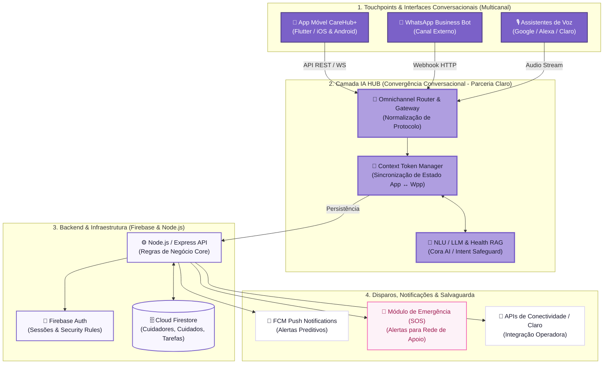

# Arquitetura da Solução — CareHub+ & IA HUB Conversacional
**Enterprise Challenge 2026 — FIAP & Claro (Atividade 3)**

---

## 1. Visão Geral do Diagrama de Arquitetura

O diagrama a seguir representa a **Arquitetura Geral da Solução CareHub+**, com a identidade visual oficial do aplicativo (`#7B61C8` Roxo Primário, Gradiente de fundo e tipografia Inter) e ênfase na camada de **IA HUB (Convergência de Interfaces Conversacionais)**.

---

## 2. Formatados de Alta Resolução Disponíveis para os Slides

Para garantir que a apresentação fique perfeita no PowerPoint/Google Slides ou PDF da entrega:

1. 🌐 **[Abrir Diagrama Interativo HTML em Tela Cheia](file:///C:/Users/gabri/.gemini/antigravity-ide/brain/eab0d95c-fdfd-4313-8ac9-beed3123c728/diagrama_arquitetura_carehub.html):** Abra este arquivo no seu navegador (Chrome/Edge), tire um print ou salve como PDF/PNG para colar diretamente no slide.
2. 📐 **[Vetor SVG de Alta Definição](file:///C:/Users/gabri/.gemini/antigravity-ide/brain/eab0d95c-fdfd-4313-8ac9-beed3123c728/diagrama_arquitetura_carehub.svg):** Pode ser importado diretamente no PowerPoint/Figma/Canva mantendo 100% da nitidez sem pixelar.

---

## 3. Diagrama Técnico em Código (Mermaid)

> **Dica para o GitHub:** Cole o código abaixo diretamente no `README.md` do seu repositório no GitHub para os professores avaliarem.

---

## 4. Detalhamento Técnico das Camadas

### 🔹 Camada 1: Touchpoints Conversacionais
* **App CareHub+ (Flutter):** Interface nativa responsiva. O chat com a assistente **Cora AI** roda sobre a arquitetura BLoC (`cora_bloc`).
* **WhatsApp & Canais de Voz:** Permite ao cuidador registrar refeições, dúvidas de dosagem ou conferir tarefas sem precisar abrir a aplicação.

### 💜 Camada 2: IA HUB (Orquestrador de Convergência Conversacional)
* **Omnichannel Router:** Recebe requisições de múltiplos canais e normaliza as mensagens.
* **Context Token Manager:** Mantém o contexto de cuidado (ex: *Vovó Lúcia* ou *Pet Yuna*) **sincronizado em tempo real** entre o App e o WhatsApp.
* **NLU / LLM Engine (Cora AI):** Identifica intenções, previne dosagens incorretas e aplica regras preditivas de salvaguarda de saúde.

### 🔹 Camada 3: Backend Core (Firebase & Node.js)
* **Firebase Auth & Firestore:** Gerenciamento seguro de sessões de cuidadores e banco de dados NoSQL reativo para o histórico de saúde.
* **API Node.js/Express:** Gerencia regras de negócio e middleware do ecossistema.

### 🔹 Camada 4: Disparos & Módulo SOS
* **FCM Push Notifications:** Envia lembretes automáticos e alertas da Cora.
* **Módulo de Emergência (SOS):** Notifica imediatamente toda a rede de apoio cadastrada em situações críticas.

---

## 5. Roteiro para o Vídeo Pitch (Seção de Arquitetura — 1 Minuto)

> *"Para suportar nossa proposta com a Claro de um Hub de Convergência de Interfaces Conversacionais, desenhamos uma arquitetura modular estruturada em 4 camadas.*
> 
> *Na ponta da experiência do usuário, temos o **CareHub+**, desenvolvido em Flutter, operando de forma integrada a canais externos como o WhatsApp e assistentes de voz.
> 
> O coração da nossa inovação é a camada de **IA HUB**. Ela atua como um orquestrador omnichannel alimentado por um mecanismo de **Context Token**. Isso significa que se o cuidador interagir com a assistente **Cora** no app para checar os remédios da Vovó Lúcia e depois mandar um áudio no WhatsApp, a IA mantém o contexto e o histórico unificados.
> 
> Essa inteligência conversa diretamente com nosso backend em **Firebase e Node.js**, garantindo respostas rápidas, segurança e o disparo automatizado de alertas para a **Rede de Apoio e botão de SOS**. Assim, unimos IA conversacional com salvaguarda real para as famílias."*
