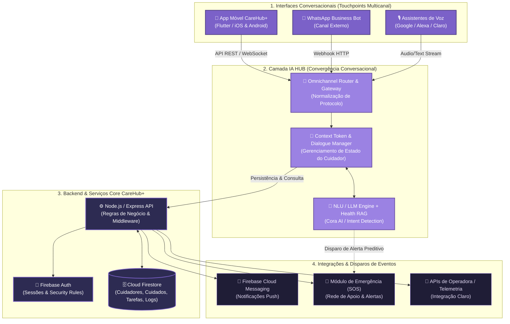

# Arquitetura da Solução — CareHub+ & IA HUB Conversacional
**Enterprise Challenge 2026 — FIAP & Claro (Atividade 3)**

---

## 1. Visão Geral do Diagrama de Arquitetura

O diagrama a seguir representa a **Arquitetura Geral da Solução CareHub+**, com ênfase na integração da camada de **IA HUB (Convergência de Interfaces Conversacionais)**.

---

## 2. Diagrama Técnico em Código (Mermaid)

> **Dica para os Slides:** Você pode copiar o código abaixo e colá-lo em ferramentas como [Mermaid Live Editor](https://mermaid.live), Draw.io ou diretamente no seu arquivo `README.md` no GitHub.

---

## 3. Detalhamento Técnico das Camadas

### 🔹 Camada 1: Interfaces Conversacionais (Front-End & Touchpoints)
* **App CareHub+ (Flutter):** Aplicação nativa multiplataforma (iOS/Android) com arquitetura BLoC. A assistente **Cora AI** está integrada diretamente no aplicativo através do BLoC de conversação (`cora_bloc`).
* **Canais Externos (WhatsApp & Voz):** Permite que o cuidador interaja por texto ou voz fora do aplicativo, garantindo acessibilidade e agilidade sem a necessidade de abrir o app para ações rápidas.

### 💜 Camada 2: IA HUB (O Núcleo de Convergência Conversacional)
* **Omnichannel Router:** Recebe mensagens de múltiplos origens (App, WhatsApp, Voz) e unifica o formato dos payloads.
* **Context Token & Dialogue Manager:** Garante que o estado do cuidador e do paciente (ex: *Vovó Lúcia* ou *Pet Yuna*) permaneça **sincronizado entre todos os canais**. Se a conversa começou no aplicativo e o usuário enviou uma dúvida pelo WhatsApp, o contexto é mantido intacto.
* **NLU / LLM Engine (Cora AI & Health RAG):** Processa intenções (ex: "Remédio da Vovó", "Alerta de Alergia", "Resumo do Dia") e aplica regras de salvaguarda de saúde com base no histórico armazenado.

### 🔹 Camada 3: Backend & Infraestrutura Core
* **Firebase Auth:** Autenticação segura por token JWT para os cuidadores.
* **API Middleware (Node.js / Express):** Orquestra chamadas entre o IA HUB e o banco de dados.
* **Cloud Firestore:** Armazena relacionalmente e em tempo real os perfis de cuidado, histórico de medicações, checklists e logs de conversa.

### 🔹 Camada 4: Integrações, Alertas & Redes de Apoio
* **Notificações Push (FCM):** Notifica cuidadores e membros da rede sobre tarefas pendentes ou mensagens proativas da Cora.
* **Módulo de Emergência (SOS):** Dispara alertas imediatos para a rede de apoio cadastrada quando um evento crítico é identificado no chat ou acionado via botão físico/digital.

---

## 4. Roteiro para o Vídeo Pitch (Seção de Arquitetura — 1 Minuto)

> **Tempo Sugerido:** ~1 minuto (dentro dos 5 minutos totais do vídeo).

**Fala Sugerida para a Apresentação:**

> *"Para suportar nossa proposta com a Claro de um Hub de Convergência de Interfaces Conversacionais, desenhamos uma arquitetura modular em 4 camadas.*
> 
> *Na ponta da experiência do usuário, temos o **CareHub+**, desenvolvido em Flutter, operando junto a canais como WhatsApp e assistentes de voz. 
> 
> O grande diferencial técnico é o nosso **IA HUB**. Ele atua como um orquestrador omnichannel que utiliza a tecnologia de **Context Token**. Isso significa que se o cuidador interagir com a assistente **Cora** dentro do app para checar a medicação da Vovó Lúcia, e depois enviar uma mensagem de voz no WhatsApp, a IA mantém todo o contexto e histórico unificados sem perda de informação.
> 
> Essa camada de IA conecta-se diretamente ao nosso backend em **Firebase e Node.js**, garantindo tempo real, segurança e disparos automáticos para o módulo de **SOS e Rede de Apoio**. Com isso, transformamos a interface conversacional em uma verdadeira ferramenta proativa de cuidado familiar."*

---

## 5. Próximos Passos para o Slide Deck (PowerPoint/PDF)
1. Insira o slide **"Arquitetura Geral da Solução & IA HUB"**.
2. Utilize a imagem exportada (`ia_hub_architecture_diagram.png`) no centro do slide.
3. Adicione 3 tópicos laterais chamativos:
   - ⚡ **Multicanalidade Integrada:** App Flutter + WhatsApp + Voz.
   - 🔑 **Context Token:** Manutenção de contexto único do cuidador em qualquer canal.
   - 🛡️ **Segurança & Proatividade:** Resposta contextualizada e disparos para Rede de Apoio/SOS.
