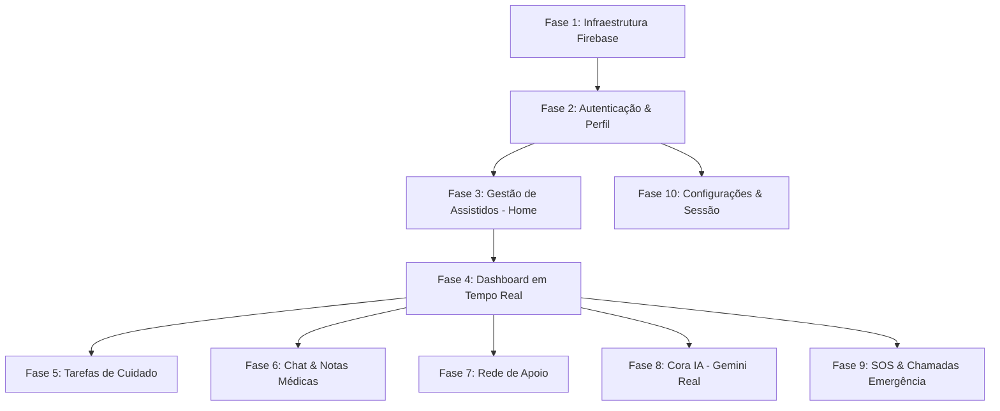

# 🚀 Plano Mestre de Integração Real & Produção — CareHub+

> **Objetivo:** Substituir 100% dos dados mockados por integração real com **Firebase (Auth, Firestore, Storage)**, **Gemini AI (Cora IA)** e serviços nativos (`url_launcher`), organizando a execução tela a tela.

---

## 🛠️ Correções de Bugs Imediatas (Concluídas ✅)

- [x] **Bug DatePicker (`AddProfileBottomSheet`):** Removida localização estática sem delegate registrado que causava crash ao abrir o seletor de data de nascimento.
- [x] **Bug SOS Tela Branca (`SosPage`):** Ajustada a checagem de estado inicial no `SosBloc`/`SosPage` para evitar estado pendente e carregamento infinito.

---

## 📅 Roadmap de Integração Tela a Tela (10 Fases)

---

### 🟢 Fase 1: Infraestrutura de Dados & Firebase Core
- **Arquivos:** `lib/core/services/firebase_service.dart`, `lib/main.dart`
- **Ações:**
  - Inicialização centralizada de `Firebase.initializeApp()`.
  - Mapeamento de coleções Firestore: `users`, `care_recipients`, `tasks`, `chat_rooms`, `messages`, `network_members`.

---

### 🟢 Fase 2: Autenticação Real & Sessão do Cuidador
- **Telas:** `SplashPage`, `LoginPage`, `RegisterPage`, `ForgotPasswordPage`
- **Arquivos:** `lib/features/auth/data/repositories/auth_repository.dart`, `lib/features/auth/presentation/bloc/auth_bloc.dart`
- **Ações:**
  - Integrar `FirebaseAuth.instance.signInWithEmailAndPassword`.
  - Suporte a `GoogleSignIn` e `FacebookAuth` reais.
  - Registro de novos cuidadores na coleção `users` do Firestore.
  - Fluxo de recuperação de senha via e-mail real.

---

### 🟢 Fase 3: Gestão de Assistidos (Home & Criar Perfil)
- **Telas:** `HomePage`, `AddProfileBottomSheet`
- **Arquivos:** `lib/features/home/data/repositories/home_repository.dart`, `lib/features/home/presentation/bloc/home_bloc.dart`
- **Ações:**
  - Conectar CRUD de assistidos (`CareRecipientModel`) com a coleção Firestore `care_recipients` filtrado por `caregiverId`.
  - Upload de foto de perfil para o `FirebaseStorage` (`/profiles/{id}/avatar.jpg`).
  - Atualização dinâmica da lista de perfis na tela `Home`.

---

### 🟢 Fase 4: Painel Principal em Tempo Real (Dashboard)
- **Tela:** `DashboardPage`
- **Arquivos:** `lib/features/dashboard/data/repositories/dashboard_repository.dart`, `lib/features/dashboard/presentation/bloc/dashboard_bloc.dart`
- **Ações:**
  - Implementar Firestore `Stream` para relatórios em tempo real:
    - Quantidade de assistidos vinculados.
    - Tarefas pendentes do dia.
    - Membros da rede de apoio ativos.
    - Mensagens não lidas de chat.
  - Sugestões dinâmicas geradas a partir do estado atual do assistido selecionado.

---

### 🟢 Fase 5: Rotina & Tarefas de Cuidado (Tarefas)
- **Telas:** `TasksPage`, `CreateTaskBottomSheet`, `TaskDetailModal`
- **Arquivos:** `lib/features/tasks/data/repositories/tasks_repository.dart`, `lib/features/tasks/presentation/bloc/tasks_bloc.dart`
- **Ações:**
  - Conectar coleção `tasks` com listeners em tempo real (`snapshots()`).
  - Criação de novas tarefas com data/hora, categoria e atribuição.
  - Alternância de estado (pendente/concluída) sincronizada instantaneamente com o banco de dados.

---

### 🟢 Fase 6: Comunicação & Chat da Rede de Apoio
- **Telas:** `ChatPage`, `ChatRoomPage`, `MedicalNoteSheet`
- **Arquivos:** `lib/features/chat/data/repositories/chat_repository.dart`, `lib/features/chat/presentation/bloc/chat_bloc.dart`
- **Ações:**
  - Sincronização real-time de conversas de grupo e individuais usando subcoleções Firestore `/chat_rooms/{id}/messages`.
  - Suporte a envio de texto, anexos e envio de **Notas Médicas** estruturadas (sintomas, dosagem, observações).

---

### 🟢 Fase 7: Rede de Apoio (Network)
- **Telas:** `NetworkPage`, `AddMemberBottomSheet`
- **Arquivos:** `lib/features/network/data/repositories/network_repository.dart`, `lib/features/network/presentation/bloc/network_bloc.dart`
- **Ações:**
  - Adição de novos membros por e-mail/telefone na coleção `network_members`.
  - Definição de permissões e papéis (Admin, Cuidador Principal, Familiar, Médico).
  - Remoção e alteração de papéis em tempo real.

---

### 🟢 Fase 8: Inteligência Artificial Real (Cora IA)
- **Tela:** `CoraChatPage`
- **Arquivos:** `lib/features/cora/data/repositories/cora_repository.dart`, `lib/features/cora/presentation/bloc/cora_bloc.dart`
- **Ações:**
  - Integrar com a **API do Gemini (Google Generative AI)**.
  - Montagem de Prompt Contextualizado com o perfil do assistido selecionado (ex: "Você é Cora, assistente do CareHub+. O assistido ativo é Vovó Lúcia, 78 anos, com tarefas de hipertensão...").
  - Geração de sugestões automáticas de respostas rápidas (*Quick Replies*).

---

### 🟢 Fase 9: SOS & Chamadas de Emergência
- **Tela:** `SosPage`
- **Arquivos:** `lib/features/sos/data/repositories/sos_repository.dart`, `lib/features/sos/presentation/bloc/sos_bloc.dart`
- **Ações:**
  - Integração do botão "Ligar" com `url_launcher` (`tel:192`, `tel:193`, etc.).
  - Disparo de alerta de pânico em tempo real gravando um registro na coleção Firestore `emergency_alerts` para notificar toda a rede de apoio.

---

### 🟢 Fase 10: Configurações & Preferências do Usuário
- **Tela:** `SettingsPage`
- **Arquivos:** `lib/features/settings/data/repositories/settings_repository.dart`, `lib/features/settings/presentation/bloc/settings_bloc.dart`
- **Ações:**
  - Persistência local (`SharedPreferences`) e remota (Firestore `/users/{id}/settings`) das preferências de notificação.
  - Fluxo de Logout seguro encerrando a sessão no `FirebaseAuth` e limpando cache local.

---

## 🎯 Instruções de Confirmação

Por favor, revise o plano acima. Assim que você aprovar, iniciaremos a execução sequencial fase por fase, validando cada tela ao final de sua respectiva etapa!
